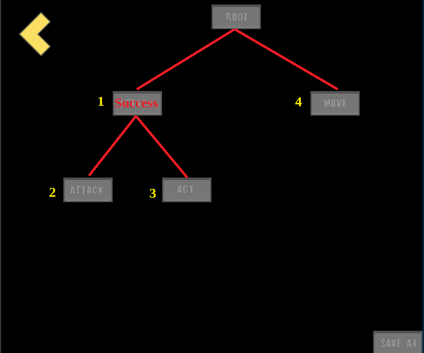
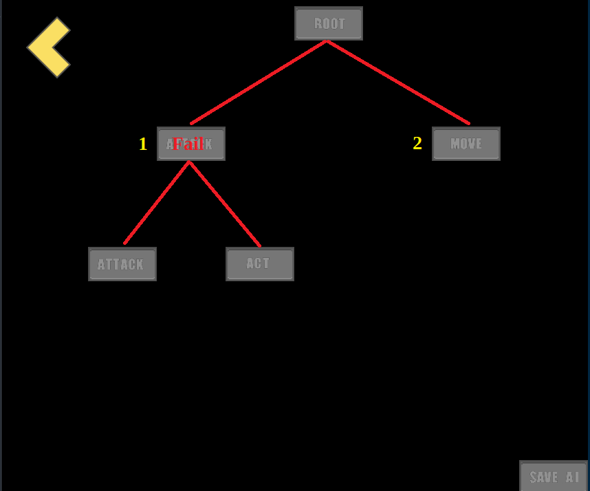

# AntScuttle

Contributors:<br>
Anthony Baird<br>
Jack Cunningham<br>
Kyle Hanson<br>

## Abstract
Artificial Intelligence has become a major field in Computer Science. The sponsor wishes to be
provided a game that can be used as an educational tool to introduce players to AI concepts. This
game must use object-oriented design patterns in order to be easily extensible so that he, or others,
can add to the project in the future with minimal effort.

This project will provide the sponsor with Antscuttle, a top-down-pixel simulator. In the game,
players will be given a scenario and, using their limited options for a level, design ants and decision
trees that will complete the level. Completing a level may involve solving an environmental puzzle
and/or defeating enemies. This gives the player a simple introduction to AI-related concepts while,
hopefully, keeping their interest.

A secondary goal was to design the game to make it easy for a developer to add new armors, weapons,
characters, and decision blocks. We chose to use an open source license to promote accessibility of
the code. The idea is that a developer should be able to add new items to the game with as little 
effort as possible, and without having to change much game code (if any).

## Project Description

TBD (what we actually built, how it works, include screenshots)

## Build
To build the project from the main directory:
```
./build.sh
```

The build provides a fat jar, which will work apart from the codebase. It can be run using:
```
java -jar antscuttle-1.6-all.jar
```

### Build / Run Requirements
Java JDK 11+

### Build Status


## Gameplay UI Tips

### AI Operation
When creating an AI, the blocks are placed in a tree structure. Each node can have two child nodes:
<br><br>

<br><br><br>
The success of each block determines the execution order; if a block succeeds, then the child blocks will be executed next:
<br><br>

<br><br><br>

If the block fails, execution goes to the siblings instead of the children:
<br><br>

<br><br><br>

When finished constructing the AI, you must hit 'Save AI' to save your changes. To use the created AI, equip it on the 'Ant' screen under the 'AI' tab.
<br><br>

## Developers

AntScuttle is designed to be easy to add new weapons, armor, levels, and ant types to the game:

### Armor

Place your new armor implementation in the Armor.implementations package. Your new armor should extend Armor. In your constructor, call super() with the appropriate parameters. Your armor should now be in the game, ready to be unlocked!

### Weapons
Swords and Pistols:

Place your new weapon implementation in the Weapon.implementations package. Your new weapon should extend either MeleeWeapon or Pistol. In your constructor, call super() with the appropriate parameters. After re-building, your weapon should now be in the game, ready to be unlocked!

Other melee or ranged weapons are not currently animated, so the BaseAnt class would need to be modified to support them.

### Levels
Place your new level implementation in the Level.levels package. Your level should extend Level. In your constructor, call super() with the appropriate parameters. After re-building, your level should new be in the game, ready to be unlocked!

- Currently, only levels designed with the Tiled editor are supported. 
- Levels are made from 16x16 tiles, but in-game they show as 32x32.
- Level size is 27w x 23h in tiles.
- If you want an object to be collidable, i.e. you don't want ants to pathfind through it, it must be added to the set collidableObjects.

### Ants
Place your new ant implementation in the Ant.implementations package. Your new ant should extend BaseAnt. In your constructor, call super() with the appropriate parameters. After re-building, your ant should now be in the game, unlocked and playable!

- You will need to specify animations for your new ant in the call to super()

### DecisionBlocks
DecisionBlocks are not currently as streamlined. Place your new DecisionBlock implementation in the AI.implementations package. Your implementation should extend DecisionBlock. In your constructor, call super() with the appropriate parameters. After re-building your block should be in the game, but it will not show on the AIEditorScreen. You will need to manually add it to this screen, using the drag-and-drop functionality displayed with the other blocks.

### BlockOptions
If you'd like a new set of options for your new DecisionBlock implementation, it should be placed in the AI.options package and should extend BlockOptions. Currently, up to two options are allowed. In your constructor, call super() with the appropriate parameters.

If you'd just like to add options to existing blocks, find the appropriate options class in the AI.options package. Add your new option to the existing option list.


### 

## Attributions

### CC0 licensed art:

<br>

Pixel Art:

https://opengameart.org/content/characters-zombies-and-weapons-oh-my

https://opengameart.org/content/roguelikerpg-pack-1700-tiles

https://opengameart.org/content/play-pause-mute-and-unmute-buttons

https://www.flaticon.com/free-icons/pause

https://opengameart.org/content/fantasy-sword-set

https://opengameart.org/content/gun-glock-26-gen5-9mm-vector

https://opengameart.org/content/armor-icons-by-equipment-slot-with-transparency

<br>

Sounds:

https://opengameart.org/content/space-1

https://opengameart.org/content/8bit-menu-highlight

https://opengameart.org/content/swishes-sound-pack

<br>

Fonts: 

https://opengameart.org/content/two-bitmap-fonts

<br>

### CC-BY-4.0 licensed art:

Link to license: https://creativecommons.org/licenses/by/4.0/legalcode

<br>

Pixel Art:

https://opengameart.org/content/pixel-art-2d-basic-menu-buttons

No extra copyright or license notices listed.

Changes were made.

<br>

### CC-BY-3.0 licensed art:

Link to license: https://creativecommons.org/licenses/by/3.0/legalcode

<br>

Sounds:

https://opengameart.org/content/chaingun-pistol-rifle-shotgun-shots

By Michel Baradari. No extra copyright or license notices.

No changes were made.
